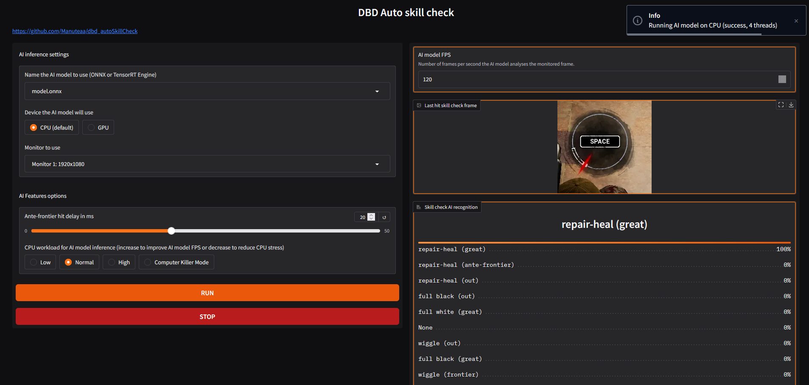
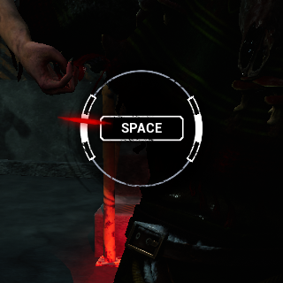
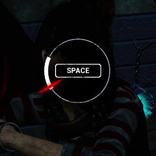

# DBD Auto Skill Check

The Dead by Daylight Auto Skill Check is a tool developed using deep learning techniques (PyTorch) to automatically detect and successfully hit skill checks in the popular game Dead by Daylight. 
This tool is designed to improve gameplay performance and enhance the player's skill in the game. 

| In-game demo (x2 speed)         |
|---------------------------------|
|  |

<!-- TOC -->
* [DBD Auto Skill Check](#dbd-auto-skill-check)
  * [Features](#features)
  * [Execution Instructions](#execution-instructions)
    * [Single prediction Web UI](#single-prediction-web-ui)
    * [Auto skill check Web UI](#auto-skill-check-web-ui)
  * [What is a skill check](#what-is-a-skill-check)
  * [Project details](#project-details)
    * [Dataset](#dataset)
    * [Architecture](#architecture)
    * [Training](#training)
    * [Inference](#inference)
    * [Results](#results)
  * [FAQ](#faq)
  * [Acknowledgments](#acknowledgments)
<!-- TOC -->

## Features
- Real-time detection of skill checks (60fps)
- High accuracy in recognizing **all types of skill checks (with a 98.7% precision, see details of [Results](#results))**
- Automatic triggering of great skill checks through auto-pressing the space bar
- Two different webUI to run the AI model

## Execution Instructions
I have only tested the model on my own computer running Windows 11 with CUDA version 12.3. I provide two different scripts you can run, here the instructions.

Create your own python env (I have python 3.11) and install the necessary libraries using the command :

`pip install numpy mss onnxruntime-gpu pyautogui IPython pillow gradio`

Then git clone the repo.

### Single prediction Web UI

Run this script to test the AI model with images of the game.

`python run_single_pred_gradio.py`

1) Select the trained AI model (default to `model.onnx` available in this repo)
2) Upload your image
3) Click Submit
4) On the right, it displays the sorted probabilities of the skill check recognition

| SINGLE prediction example 1                    | SINGLE prediction example 2                    |
|------------------------------------------------|------------------------------------------------|
|  |  |

### Auto skill check Web UI

Run this script and play the game ! It will hit the space bar for you.

`python run_monitoring_gradio.py`

1) Select the trained AI model (default to `model.onnx` available in this repo)
2) Select the device to use. Select "CPU", except if you need to improve the AI model FPS [FAQ](#faq)
3) Choose debug options. I recommend setting this option to None. If you want to check which screen the script is monitoring, you can select the first option. If the AI struggles recognizing the skill checks, select the second option to save the results, then you can upload the images in a new GitHub issue
4) Click 'RUN'
5) You can STOP and RUN the script from the Web UI at will, for example when waiting in the game lobby

Your main screen is now monitored meaning that frames are regularly sampled (with a center-crop) and analysed with the trained AI model.
You can play the game on your main monitor.
When a great skill check is detected, the SPACE key is automatically pressed, then it waits for 0.5s to avoid triggering the same skill check multiple times in a row.

| Auto skill check example 1            | Auto skill check example 2            |
|---------------------------------------|---------------------------------------|
|  |  |

On the right of the web UI, we display :
- The AI model FPS : the number of frames per second the AI model processes
- The last hit skill check frame : last frame (center-cropped image with size 224x224) the AI model triggered the SPACE bar. **This may not be the actual hit frame (as registered by the game) because of game latency (such as ping). The AI model anticipates the latency, and hits the space bar a little bit before the cursor reaches the great area, that's why the displayed frame will always be few frames before actual game hit frame**
- Skill check recognition : set of probabilities for the frame displayed before

**Both the game AND the AI model FPS must run at 60fps (or more) in order to hit correctly the great skill checks.** 
I had the problem of low FPS with Windows : when the script was on the background (when I played), the FPS dropped significantly. Running the script in admin solved the problem (see the [FAQ](#faq)).

## What is a skill check

A skill check is a game mechanic in Dead by Daylight that allows the player to progress faster in a specific action such as repairing generators or healing teammates.
It occurs randomly and requires players to press the space bar to stop the progression of a red cursor.

Skill checks can be: 
- failed, if the cursor misses the designated white zone (the hit area)
- successful, if the cursor lands in the white zone 
- or greatly successful, if the cursor accurately hits the white-filled zone 

Here are examples of different great skill checks:

|     Repair-Heal skill check     |       Wiggle skill check        |       Full white skill check        |        Full black skill check         |
|:-------------------------------:|:-------------------------------:|:-----------------------------------:|:-------------------------------------:|
|  |  |  |  |

Successfully hitting a skill check increases the speed of the corresponding action, and a greatly successful skill check provides even greater rewards. 
On the other hand, missing a skill check reduces the action's progression speed and alerts the ennemi with a loud sound.

## Project details

### Dataset
We designed a custom dataset from in-game screen recordings and frame extraction of gameplay videos on youtube.
To save disk space, we center-crop each frame to size 320x320 before saving.

The data was manually divided into 11 separate folders based on :
- The visible skill check type : Repairing/healing, struggle, wiggle and special skill checks (overcharge, merciless storm, etc.) because the skill check aspects are different following the skill check type
- The position of the cursor relative to the area to hit : outside, a bit before the hit area and inside the hit area.

**We experimentally made the conclusion that following the type of the skill check, we must hit the space bar a bit before the cursor reaches the great area, in order to anticipate the game input processing latency.
That's why we have this dataset structure and granularity (with ante-frontier and frontier areas recognition).**

To alleviate the laborious collection task, we employed data augmentation techniques such as random rotations, random crop-resize, and random brightness/contrast/saturation adjustments.

We developed a customized and optimized dataloader that automatically parses the dataset folder and assigns the correct label to each image based on its corresponding folder.
Our data loaders use a custom sampler to handle imbalanced data.

### Architecture
The skill check detection system is based on an encoder-decoder architecture. 

We employ the MobileNet V3 Small architecture, specifically chosen for its trade-off between inference speed and accuracy. 
This ensures real-time inference and quick decision-making without compromising detection precision.
We also compared the architecture with the MobileNet V3 Large, but the accuracy gain was not worth a bigger model size (20Mo instead of 6Mo) and slower inference speed.

We had to manually modify the last layer of the decoder. Initially designed to classify 1000 different categories of real-world objects, we switched it to an 11-categories layer.

### Training

We use a standard cross entropy loss to train the model and monitor the training process using per-category accuracy score.

I trained the model using my own computer, and using the AWS _g6.4xlarge_ EC2 instance (around x1.5 faster to train than on my computer).

### Inference
We provide a script that loads the trained model and monitors the main screen.
For each sampled frame, the script will center-crop and normalize the image then feed it to the AI model.

Following the result of the skill check recognition, the script will automatically press the space bar to trigger the great skill check (or not), 
then it waits for a short period of time to avoid triggering the same skill check multiple times in a row.

To achieve real time results, we convert the model to ONNX format and use the ONNX runtime to perform inference. 
We observed a 1.5x to 2x speedup compared to baseline inference.

### Results

We test our model using a testing dataset of ~2000 images:

| Category Index | Category description        | Mean accuracy |
|----------------|-----------------------------|---------------|
| 0              | None                        | 100.0%        |
| 1              | repair-heal (great)         | 99.5%         |
| 2              | repair-heal (ante-frontier) | 96.5%         |
| 3              | repair-heal (out)           | 98.7%         |
| 4              | full white (great)          | 100%          |
| 5              | full white (out)            | 100%          |
| 6              | full black (great)          | 100%          |
| 7              | full black (out)            | 98.9%         |
| 8              | wiggle (great)              | 93.4%         |
| 9              | wiggle (frontier)           | 100%          |
| 10             | wiggle (out)                | 98.3%         |

During our laptop testing, we observed rapid inference times of approximately 10ms per frame using MobileNet V3 Small. 
When combined with our screen monitoring script, we achieved a consistent 60fps detection rate, which is enough for real-time detection capabilities.

In conclusion, our model achieves high accuracy thanks to the high-quality dataset with effective data augmentation techniques, and architectural choices.
**The RUN script successfully hits the great skill checks with high confidence.**

## FAQ

How to run the AI model with your GPU ?
- Check if you have `pip install onnxruntime-gpu` and not onnxruntime (if not, uninstall onnxruntime before installing onnxruntime-gpu)
- Check onnxruntime-gpu version compatibilities with CUDA, CUDNN and torch https://onnxruntime.ai/docs/execution-providers/CUDA-ExecutionProvider.html#requirements
- Install CUDA 12.x (I have 12.3)
- Install torch with CUDA compute (I have 2.4.0 with cuda 12.1 compute platform) https://pytorch.org/get-started/locally/
- Install CUDNN 9.x (I have 9.4)
- Install last version of MSVC
- Select "GPU" in the Auto skill check webUI, click "RUN" and check if you have a warning message

Why does the script do nothing ?
- Check if the AI model monitors correctly your game: set the debug option of the webui to "display the monitored frame". Play the game and check if it displays correctly the skill check
- Check if you have no error in the python console logs
- Check if your game settings are not unusual (such as special resolution or game filters): your displayed images "last hit skill check frame" should be similar with the ones in my examples
- Check if you do not use a potato instead of a computer

Why do I hit good skill checks instead of great ? Be sure :
- Your game FPS >= 60
- The AI model FPS >= 60
- Your ping is not too high (<= 60 should be fine)
- Disable Vsync and FSR in the game settings

I have lower values than 60 FPS for the AI model, what can I do ?
- Switch device to gpu
- Disable the energy saver settings in your computer settings
- Run the script in administrator mode

Why does the AI model hit the skill check too early and fails ?
- You may experience a very low ping (this is good) combined with a better computer than mine. Edit the file `dbd/AI_model.py` to disable the ante-frontier hits (set hit variable to False, for example `2: {"desc": "repair-heal (ante-frontier)", "hit": False}`)

Does the script work well with the perk hyperfocus ?
- Yes

Does the script work well for skill checks in random locations (doctor skill checks) ?
- Unfortunately, the script only monitors a small part of the center of your screen. It can not see the skill checks outside this area. Even if you make it work by editing the code (like capturing the whole screen and resize the frames to 224x224) the AI model was not trained to handle these special skill checks, so it will not work very well...

What about the anti-cheat system ?
- The script monitors a small crop of your main screen, and can press then release the space bar using [Windows MSDN](https://learn.microsoft.com/en-us/windows/win32/inputdev/virtual-key-codes?redirectedfrom=MSDN) once each 0.5s maximum. I don't know if this can be detected as a cheat
- I played the game quite a lot with the script on, and never had any problem. However, I can't and will not generalize, so I can't really answer to this question...

## Acknowledgments

A big thanks to [hemlock12](https://github.com/hemlock12) for the data collection help !

The project was made and is maintained by me ([Manuteaa](https://github.com/Manuteaa)). If you like it, and want to tell it you can simply star this project !
You want to say a thank-you ? Discuss new project(s) collaboration (for example for the killer side) ? Contact me on discord: manuteaa

An issue ? Questions ? Suggestions ? Just open a new issue
